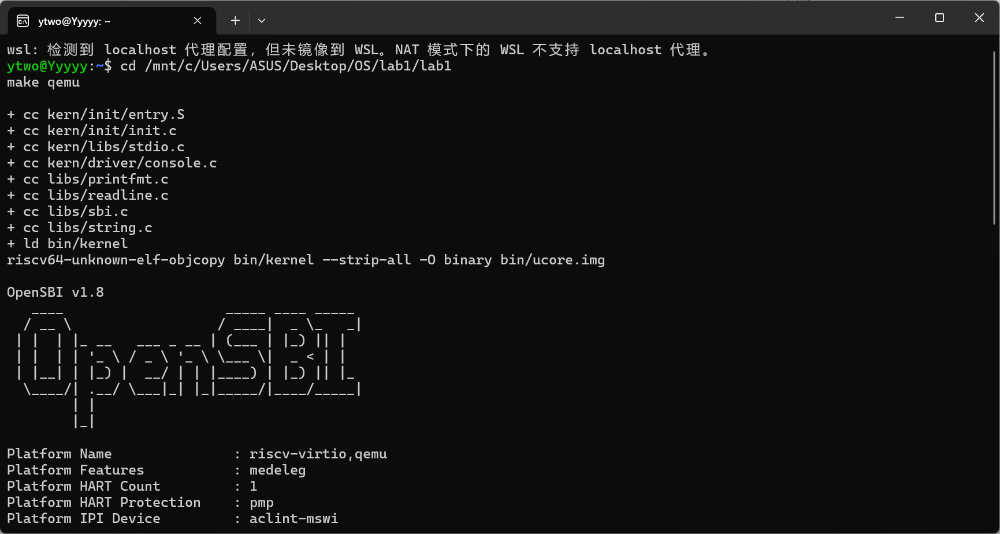
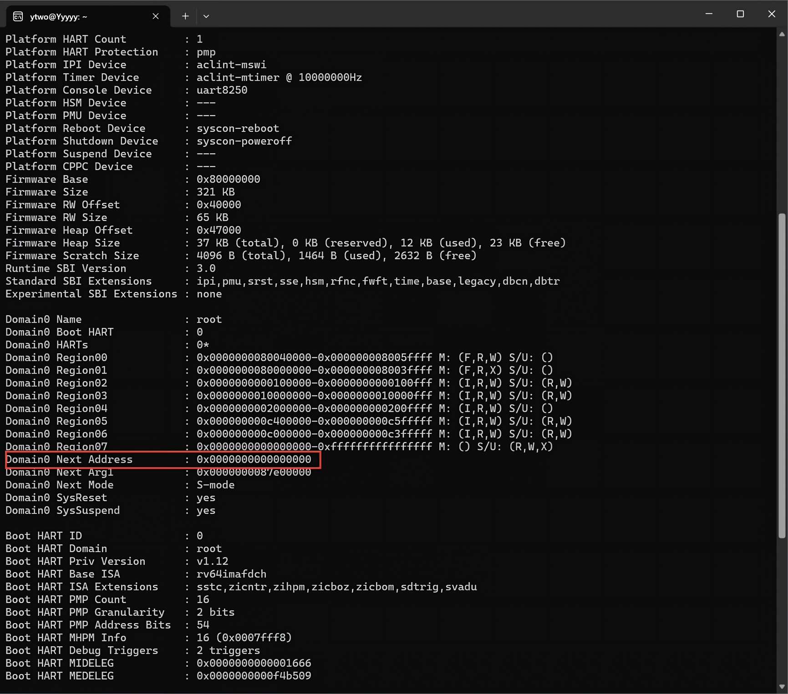
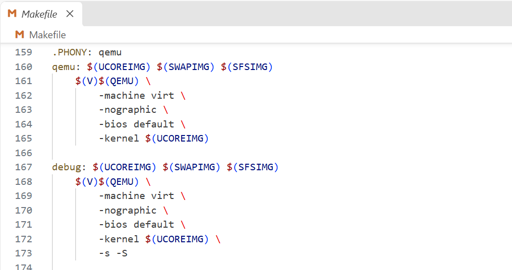
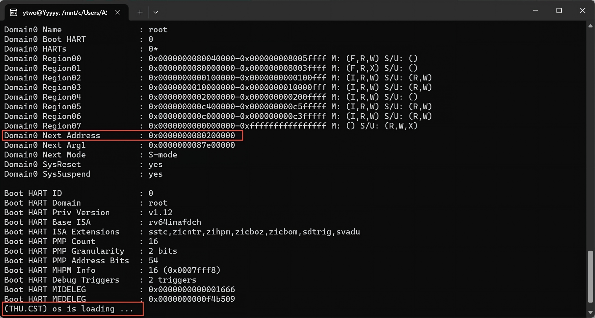
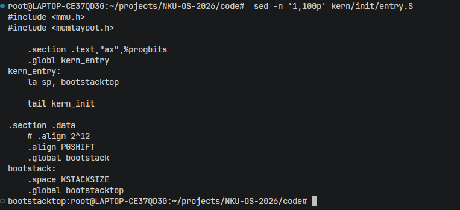
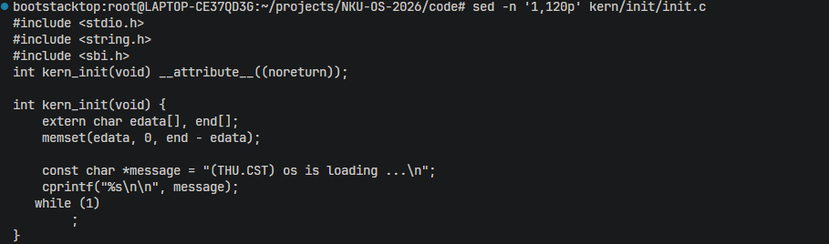
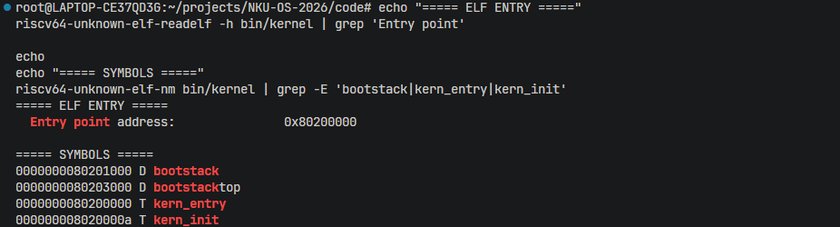
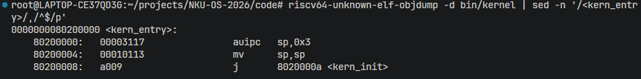
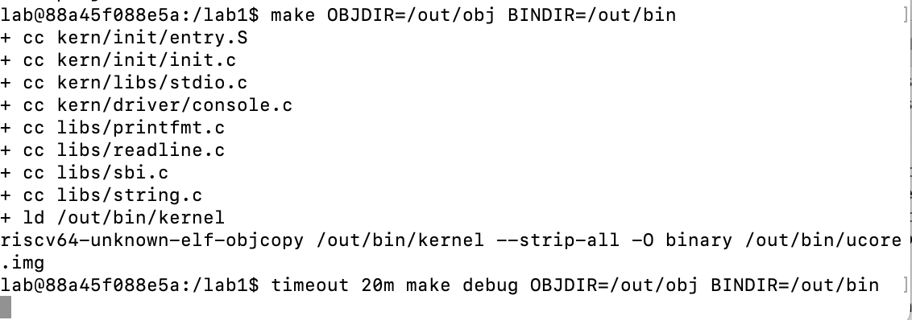

# OS\-lab1：最小可执行内核\-实验报告共享文档

## **实验基本信息**

|项目|内容|
|---|---|
|**实验名称**|Lab 1: 最小可执行内核|
|**小组成员**|2412266\-杨滢、2412103\-唐健、2412566\-曹子衿|
|**完成日期**|2026\-10\-9|

### **小组分工**

##### **\(1\)**练习分工：

|成员|负责的练习/模块|
|---|---|
|2412266\-杨滢|功能模块：内核编译、链接、镜像生成与启动验证|
|2412103\-唐健|练习1：理解内核启动中的程序入口操作|
|2412566\-曹子衿|练习2：使用GDB验证启动流程；测试与验证|

##### **\(2\)**实验报告撰写分工：

|成员|负责的练习/模块|
|---|---|
|2412266\-杨滢|第一、二、三、六章；第四章4\.1节功能模块部分|
|2412103\-唐健|第四章4\.2节练习1部分；第六章|
|2412566\-曹子衿|第四章4\.3节练习2部分；第五、六章|

---

## **一、实验目的**

本实验的主要目的是：

1. 理解 RISC\-V 最小可执行内核的组成，以及 QEMU、OpenSBI 和操作系统内核之间的启动关系。

2. 掌握内核源代码的交叉编译、链接、ELF 文件生成及二进制内核镜像生成过程，并理解链接脚本对内存布局和入口地址的作用。

3. 理解内核从汇编入口 `kern_entry` 进入 C 语言函数 `kern_init()` 的执行过程，以及通过 SBI 服务实现控制台信息输出的机制。

4. 学习使用 QEMU 和 GDB 观察、验证 RISC\-V 从加电复位到执行内核第一条指令的完整流程。

5. 学习使用 AI 工具辅助阅读实验文档、分析内核代码、排查环境兼容问题并整理实验报告

---


## **二、实验环境**

### 2\.1 AI 工具

|成员|AI 编程工具|底层模型|备注|
|---|---|---|---|
|2412266\-杨滢|OpenAI Codex|GPT\-5\.6|无|
|2412103\-唐健|OpenAI Codex|GPT\-5\.6|无|
|2412566\-曹子衿|OpenAI Codex|GPT\-6|无|

---

### 2\.2 系统与工具环境

本实验包含两组运行环境：功能模块与练习 1 主要在 WSL2 环境中完成；练习 2 的 GDB 调试在 macOS 宿主机的 Docker 环境中完成。两组实验记录分别用于验证内核的构建、启动和调试过程，具体配置见相应章节。

| 项目 | 配置信息 |
|---|---|
| 虚拟化环境 | Windows Subsystem for Linux 2（WSL2） |
| Linux 发行版 | Ubuntu 26.04 LTS |
| Linux 内核 | 6.18.33.2-microsoft-standard-WSL2 |
| 主机架构 | x86_64 |
| 目标架构 | RISC-V 64 位 |
| QEMU 版本 | 10.2.1 |
| OpenSBI 版本 | 1.8 |
| RISC-V 交叉编译器 | riscv64-unknown-elf-gcc 15.1.0 |
| GNU Make 版本 | 4.4.1 |

## **三、实验整体逻辑分析**

### **3\.1 本章节的逻辑主线**

本章围绕**构建最小可执行内核**这一主题展开。旨在建立操作系统最基础的运行框架，使内核能够被正确编译、加载和执行，并具备向控制台输出信息的能力。

本章实验主要解决以下问题：

- 在尚不存在完整操作系统运行环境的情况下，如何将内核源代码交叉编译为RISC\-V可执行文件；

- 如何利用链接脚本确定内核入口和内存布局；

- 如何通过QEMU和OpenSBI将内核加载到指定地址并移交CPU控制权。在内核开始执行后，还需要完成内核栈初始化，从汇编入口进入C语言初始化函数，并借助OpenSBI提供的SBI服务输出启动信息。


### 3\.2 功能的逐步实现

1. 首先完成**源代码的交叉编译**。实验代码需要运行在RISC\-V平台，而实验主机为x86\_64架构，因此使用`riscv64-unknown-elf-gcc`生成RISC\-V目标文件。

2. 接着**通过链接脚本组织内核**。`tools/kernel.ld`规定内核入口为`kern_entry`，将内核基地址设置为`0x80200000`，并依次安排`.text`、`.rodata`、`.data`和`.bss`等部分。

3. 然后**生成内核镜像**。链接器将各目标文件链接为`bin/kernel`，该文件采用ELF格式并保留符号和调试信息；`objcopy`进一步将其转换为可直接装入内存的`bin/ucore.img`。

4. 随后**由QEMU和OpenSBI启动内核**。QEMU模拟RISC\-V硬件，OpenSBI在M模式下完成底层初始化，并将控制权交给运行在S模式下的内核。

5. 最后**验证内核运行结果**。内核成功输出`(THU.CST) os is loading ...`，说明编译、链接、镜像生成、控制权移交和控制台输出流程均正确执行。

---

## **四、实验内容与实现**

### **4\.1 功能模块：**内核编译、链接、镜像生成与启动验证

**负责人：** 2412266\-杨滢

#### **4\.1\.1 模块功能描述**

##### **\(1\)需要实现/修改的函数：**

本模块主要完成实验代码的构建流程分析和启动验证，**不需要新增或修改内核函数**。构建及启动过程中涉及的主要入口符号和函数为：

```C
int kern_init(void) __attribute__((noreturn));
```

##### **\(2\)功能说明：**

本模块负责分析并验证最小内核从源代码到实际运行的完整过程，主要包括以下内容：

- 使用 RISC\-V 交叉编译工具链编译 C 语言和汇编源文件；

- 使用链接脚本将目标文件链接为 ELF 格式的内核文件；

- 将 ELF 文件转换为可由 QEMU 加载的原始二进制内核镜像；

- 验证链接脚本设置的内核入口地址和各程序段的内存布局；

- 使用 QEMU 和 OpenSBI 启动内核；

- 根据 OpenSBI 和内核的终端输出判断启动流程是否正确；

- 分析原 QEMU 镜像加载方式在当前实验环境中的兼容性问题；

- 将 Makefile 中 qemu 和 debug 目标的镜像加载参数由 \-device loader 调整为 \-kernel；

- 验证修改后 OpenSBI 能否获得正确的内核入口地址并将控制权移交给内核。

本次修改仅涉及 Makefile 中的 QEMU 镜像加载参数，用于兼容本实验所使用的 QEMU 10\.2\.1 和 OpenSBI 1\.8，不改变内核功能代码及其执行逻辑。

#### **4\.1\.2最终提示词**

以下是经过迭代优化后，最终成功实现该功能的提示词：

```Markdown
[ROLE]
你是一名熟悉RISC-V、GNU交叉编译工具链、QEMU、OpenSBI和ucore的操作系统实验助教。
[CONTEXT]
当前实验为ucore Lab1“比麻雀更小的麻雀（最小可执行内核）”。
实验代码包括Makefile、tools/function.mk、tools/kernel.ld、
kern/init/entry.S、kern/init/init.c及SBI控制台输出相关代码。
实验环境为WSL2中的Ubuntu，使用riscv64-unknown-elf工具链
和qemu-system-riscv64。
[TASK]
1. 阅读实验文档和项目代码，分析内核源代码的编译、链接和镜像生成过程。
2. 说明Makefile、function.mk和kernel.ld在构建过程中的作用。
3. 说明bin/kernel与bin/ucore.img的格式、用途及区别。
4. 验证ELF文件的目标架构和入口地址是否正确。
5. 分析QEMU、OpenSBI和ucore内核之间的启动关系。
6. 根据终端输出判断内核是否成功启动。
7. 如果OpenSBI显示Domain0 Next Address为0且内核没有输出，
   分析问题原因，并给出适用于当前QEMU版本的验证方法。
8. 不修改内核功能代码，所有结论均以实验文档、项目代码
   和实际终端输出为依据。
[OUTPUT]
使用本科操作系统实验报告的书面表达方式输出，内容应包括：
编译流程、链接过程、内存布局、镜像生成、启动过程、
问题分析、解决方法和最终验证结果。
```


#### **4\.1\.3实现迭代过程**

本模块的实现经历了2次迭代，过程如下：

---

##### **第一次迭代：使用原Makefile编译并启动**

首先在实验项目根目录执行：

```Plain Text
make qemu
```

实验代码成功完成编译、链接和镜像生成，终端输出包括：

```Plain Text
+ cc kern/init/entry.S
+ cc kern/init/init.c
+ cc kern/libs/stdio.c
+ cc kern/driver/console.c
+ cc libs/printfmt.c
+ cc libs/readline.c
+ cc libs/sbi.c
+ cc libs/string.c
+ ld bin/kernel
riscv64-unknown-elf-objcopy bin/kernel --strip-all -O binary bin/ucore.img
```

由此可知，源文件已经成功编译，目标文件也被链接为 bin/kernel，随后通过 objcopy 生成了 bin/ucore\.img。



**遇到的问题：**

QEMU和OpenSBI能够正常启动，但终端中显示：

```Plain Text
Domain0 Next Address : 0x0000000000000000
```

同时没有出现预期的内核输出：

```Plain Text
(THU.CST) os is loading ...
```

这说明内核镜像虽然已经成功生成，但 OpenSBI 没有获得正确的下一阶段入口地址，因此未能将控制权移交给位于0x80200000的内核。



进一步检查 Makefile 后发现，原启动命令使用：

```Plain Text
-device loader,file=$(UCOREIMG),addr=0x80200000
```

该参数能够将镜像写入指定内存地址，但在本实验使用的 QEMU 10\.2\.1 和 OpenSBI 1\.8 环境中，没有将 `0x80200000` 正确设置为 OpenSBI 的下一阶段入口地址。

**问题解决策略：**

1. 检查 `bin/kernel` 和 `bin/ucore.img` 是否成功生成，确认编译、链接及镜像生成过程已经正常完成；

2. 使用 `readelf` 检查 `bin/kernel` 的目标架构和入口地址，确认其目标架构为 RISC\-V，入口地址为 `0x80200000`；

3. 将 ELF 入口地址与 OpenSBI 输出的 `Domain0 Next Address` 进行对比，确认问题位于 QEMU 镜像加载方式，而不是内核代码、链接脚本或镜像生成过程；

4. 保持内核功能代码和生成的内核镜像不变，将 Makefile 中 `qemu` 和 `debug` 目标使用的 `-device loader` 参数调整为 `-kernel`；

5. 重新执行 `make clean` 和 `make qemu`，检查 OpenSBI 是否获得正确的下一阶段入口地址，并验证内核能否成功输出启动信息。

**第一次迭代结论：**

第一次迭代确认了内核源代码能够正常完成编译、链接和镜像生成，但原Makefile中的QEMU镜像加载参数与当前使用的QEMU 10\.2\.1和OpenSBI 1\.8**存在兼容性问题**。因此，问题不在内核功能代码和链接过程，而在QEMU向 OpenSBI提供下一阶段入口地址的方式，需要在第二次迭代中修改Makefile的相关启动参数。

---

##### **第二次迭代：**修改Makefile中的QEMU镜像加载方式

原Makefile中的qemu目标使用：

```Makefile
-device loader,file=$(UCOREIMG),addr=0x80200000
```

该参数能够将镜像写入指定内存地址，但在本实验使用的QEMU 10\.2\.1 和 OpenSBI 1\.8环境中，OpenSBI 未能获得正确的下一阶段入口地址。

为了使标准的 `make qemu` 命令可以直接启动内核，将`qemu`目标修改为：

```Plain Text
qemu: $(UCOREIMG) $(SWAPIMG) $(SFSIMG)
        $(V)$(QEMU) \
                -machine virt \
                -nographic \
                -bios default \
                -kernel $(UCOREIMG)
```

同时，将 `debug` 目标修改为：

```Plain Text
debug: $(UCOREIMG) $(SWAPIMG) $(SFSIMG)
        $(V)$(QEMU) \
                -machine virt \
                -nographic \
                -bios default \
                -kernel $(UCOREIMG) \
                -s -S
```



修改完毕之后，输入命令：

```Makefile
make clean
make qemu
```

可以观察到生成结果正确并成功输出 `(THU.CST) os is loading ...`：



##### 最终结果

经过两次迭代，本模块最终完成了以下工作：

- RISC\-V 内核源代码交叉编译成功；

- ELF 格式内核文件链接成功；

- 原始二进制内核镜像生成成功；

- ELF 文件的目标架构验证为 RISC\-V；

- ELF 文件的入口地址验证为 `0x80200000`；

- 修改 Makefile 中的 QEMU 镜像加载参数；

- `make qemu` 可以在当前环境中直接启动内核；

- OpenSBI 的下一阶段入口地址为 `0x80200000`；

- OpenSBI 成功以 S 模式将控制权移交给内核；

- 内核成功输出 `(THU.CST) os is loading ...`；

- 未修改任何内核功能代码。

##### 关键改进点总结

- 在验证过程中记录了 QEMU、OpenSBI 和交叉编译工具链版本，使问题分析与实际实验环境保持一致。

- 对比 ELF 入口地址和 OpenSBI 的 `Domain0 Next Address`，确认问题出在镜像加载方式，而不是编译、链接或内核代码。

- 将 Makefile 中 `qemu` 和 `debug` 目标的 `-device loader`参数替换为 `-kernel $(UCOREIMG)`，使 `make qemu` 能够在当前实验环境中直接启动内核。

- 本次修改是针对当前QEMU/OpenSBI 版本的启动兼容性调整。

---

### **4\.2 练习1：理解内核启动中的程序入口操作**

**负责人：**  2412103\-唐健

#### 4\.2\.1 模块功能描述

##### \(1\)涉及的入口符号和函数


本练习主要分析 RISC\-V 内核从汇编入口进入 C 语言初始化函数的过程，不需要新增或修改内核功能代码。
涉及的主要入口代码位于 kern/init/entry\.S

```Assembly language
kern_entry:
    la sp, bootstacktop

    tail kern_init
```

同时，`entry.S` 中定义了内核启动阶段使用的栈空间：

```Plain Text
.section .data
.align PGSHIFT
.global bootstack
bootstack:
    .space KSTACKSIZE
.global bootstacktop
bootstacktop:
```

进入 C 语言代码后执行的主要函数位于 `kern/init/init.c`：

```Plain Text
int kern_init(void) __attribute__((noreturn));
```

实验文档说明，OpenSBI 完成初始化后会将控制权移交至位于 `0x80200000` 的内核入口，随后开始执行 `kern/init/entry.S`。`entry.S` 首先建立内核栈环境，然后转入 C 语言函数 `kern_init()`。

##### \(2\)功能说明

本练习主要完成以下内容：

- 阅读并分析 `kern/init/entry.S`；

- 理解 `sp` 栈指针寄存器与 `bootstacktop` 的关系；

- 分析 `la sp, bootstacktop` 完成的操作及其目的；

- 分析 `tail kern_init` 完成的控制流转移及其目的；

- 阅读 `kern_init()`，分析使用 `tail` 而不是普通函数调用的原因；

- 使用 `readelf`、`nm` 和 `objdump` 验证内核入口地址、启动栈地址和实际生成的机器指令；

- 将源码中的汇编伪指令与最终生成的 RISC\-V 指令进行对应。

实验代码通过 `.space KSTACKSIZE` 预留内核启动栈，并使用 `bootstacktop` 表示栈顶。实验文档对 `kern_entry` 的作用概括为：完成内核栈设置，然后跳转到 `kern_init()`。

---

#### 4\.2\.2 提示词

以下是提示词：

```Plain Text
[PROMPT]
阅读 `kern/init/entry.S` 和 `kern/init/init.c`，完成 Lab1 练习1。

重点说明：
1. `la sp, bootstacktop` 完成了什么操作，目的是什么；
2. `tail kern_init` 完成了什么操作，目的是什么。

结合实际代码和编译结果进行分析，不修改现有代码。

[RELY]
可以依赖以下已有内容：

- `kern/init/entry.S` 中的 `kern_entry`、`bootstack`、`bootstacktop`
- `kern/init/init.c` 中的 `kern_init()`
- `bin/kernel` 的符号表和反汇编结果
- 内核入口地址为 `0x80200000`

[GUARANTEE]
本练习不需要新增或修改函数。

需要完成：
- 对 `la sp, bootstacktop` 的作用进行说明；
- 对 `tail kern_init` 的作用进行说明；
- 结合实际代码说明内核从 `kern_entry` 进入 `kern_init()` 的过程。

[SPECIFICATION]
## kern_entry

**Pre-Condition**:
- OpenSBI 已将控制权交给内核入口；
- 启动栈空间已经预留。

**Post-Condition**:
- `sp` 指向 `bootstacktop`；
- CPU 执行流程进入 `kern_init()`。

`la sp, bootstacktop` 用于初始化内核启动栈，为后续 C 语言函数执行提供栈环境。

`tail kern_init` 用于将执行流程直接转移到 `kern_init()`。由于 `kern_init()` 最终进入无限循环，不需要返回 `kern_entry`。
```

---

#### 4\.2\.3 分析与验证过程

本练习主要分为源码分析和实际编译结果验证两个阶段。

##### 第一阶段：阅读 `entry.S`，分析汇编入口

首先在实验项目目录中执行：

```Plain Text
sed -n '1,100p' kern/init/entry.S
```

得到内核入口的核心代码：

```Plain Text
.section .text,"ax",%progbits
.globl kern_entry

kern_entry:
    la sp, bootstacktop

    tail kern_init

.section .data
.align PGSHIFT
.global bootstack
bootstack:
    .space KSTACKSIZE
.global bootstacktop
bootstacktop:
```

实验文档同样给出了这一入口结构，并说明 `.space KSTACKSIZE` 用于预留内核栈空间，而 `bootstacktop` 位于启动栈的高地址端。

**图 4\-2\-1 ****`kern/init/entry.S`**** 内核入口源码**




###### 1\. `la sp, bootstacktop` 的作用

`sp` 是 RISC\-V 中的栈指针寄存器，即 Stack Pointer。

入口代码执行：

```Plain Text
la sp, bootstacktop
```

其中，`la` 是 Load Address 伪指令，其作用是将符号 `bootstacktop` 所表示的地址装入 `sp`。

因此该指令执行完成后的逻辑效果可以表示为：

```Plain Text
sp = &bootstacktop
```

`bootstack` 和 `bootstacktop` 之间的内存区域由：

```Plain Text
.space KSTACKSIZE
```

提前预留，作为内核启动阶段使用的栈空间。

RISC\-V 的栈通常从高地址向低地址增长，因此将 `sp` 初始化为 `bootstacktop`，可以使后续 C 语言函数从启动栈顶部开始使用栈空间。

设置该指令的主要目的是：在进入 C 语言内核初始化函数前建立一个合法的栈环境，使后续函数调用、局部变量保存和寄存器保存等操作能够正常执行。

因此，`la sp, bootstacktop` 实际完成的是：**在内核正式进入 C 语言代码之前初始化内核启动栈**。

---

##### 第二阶段：分析 `kern_init()`

随后查看：

```Plain Text
sed -n '1,120p' kern/init/init.c
```

得到：

```Plain Text
int kern_init(void) __attribute__((noreturn));

int kern_init(void) {
    extern char edata[], end[];
    memset(edata, 0, end - edata);

    const char *message = "(THU.CST) os is loading ...\n";
    cprintf("%s\n\n", message);

    while (1)
        ;
}
```


**图 4\-2\-2 ****`kern_init()`**** 内核初始化函数源码**



可以看到，`kern_init()` 被声明为：

```Plain Text
__attribute__((noreturn))
```

说明该函数不会返回调用者。

函数首先使用：

```Plain Text
memset(edata, 0, end - edata);
```

完成 `.bss` 区域的初始化；随后调用：

```Plain Text
cprintf("%s\n\n", message);
```

输出内核启动信息；最后进入：

```Plain Text
while (1)
    ;
```

无限循环。

实验文档也明确说明，`kern_init()` 会清零 `.bss`、输出启动字符串，随后进入无限循环。  

因此，`kern_init()` 在执行后不会重新返回 `kern_entry`，这也是入口代码适合使用 `tail kern_init` 的重要原因。

---

##### 第三阶段：验证内核入口与符号地址

为了验证源码中的地址关系，使用 `readelf` 检查 ELF 入口：

```Plain Text
riscv64-unknown-elf-readelf -h bin/kernel | grep 'Entry point'
```

同时使用 `nm` 查看相关符号：

```Plain Text
riscv64-unknown-elf-nm bin/kernel | grep -E 'bootstack|kern_entry|kern_init'
```

实际实验得到：

```Plain Text
===== ELF ENTRY =====
Entry point address:               0x80200000

===== SYMBOLS =====
0000000080201000 D bootstack
0000000080203000 D bootstacktop
0000000080200000 T kern_entry
000000008020000a T kern_init
```


**图 4\-2\-3 内核入口及启动相关符号地址验证**



由此可得：

```Plain Text
kern_entry    = 0x80200000
bootstack     = 0x80201000
bootstacktop  = 0x80203000
kern_init     = 0x8020000a
```

其中：

```Plain Text
bootstacktop - bootstack
= 0x80203000 - 0x80201000
= 0x2000
= 8192 Byte
= 8 KiB
```

因此，本次实验实际为启动阶段预留了 8 KiB 的内核栈空间。

同时：

```Plain Text
Entry point address = 0x80200000
kern_entry          = 0x80200000
```

两者完全一致，说明 ELF 文件的入口点确实对应 `kern_entry`。

---

##### 第四阶段：反汇编验证 `la` 与 `tail`

为了进一步验证两条汇编指令在最终机器代码中的实际形式，执行：

```Plain Text
riscv64-unknown-elf-objdump -d bin/kernel | \
sed -n '/<kern_entry>/,/^$/p'
```

得到：

```Plain Text
0000000080200000 <kern_entry>:
    80200000:   00003117    auipc   sp,0x3
    80200004:   00010113    mv      sp,sp
    80200008:   a009        j       8020000a <kern_init>
```


**图 4\-2\-4 ****`kern_entry`**** 反汇编结果**



源码中的：

```Plain Text
la sp, bootstacktop
```

是一条汇编伪指令。

从反汇编结果可以看到，它最终对应：

```Plain Text
auipc sp,0x3
mv    sp,sp
```

此时 `kern_entry` 位于：

```Plain Text
0x80200000
```

而：

```Plain Text
0x80200000 + 0x3000
= 0x80203000
```

正好等于：

```Plain Text
bootstacktop = 0x80203000
```

因此可以确认，执行完该指令序列后，`sp` 最终指向 `bootstacktop`，即启动栈顶部。

其中反汇编显示的：

```Plain Text
mv sp,sp
```

在本次链接结果中等价于对低位偏移为 0 的处理，因此最终没有额外改变 `sp` 的值。

由此实际验证了：

```Plain Text
la sp, bootstacktop
```

确实完成了内核栈指针初始化。

---

###### 2\. `tail kern_init` 的作用

完成栈初始化以后，入口代码执行：

```Plain Text
tail kern_init
```

`tail` 是用于尾调用的汇编伪指令。

反汇编结果为：

```Plain Text
80200008: a009    j 8020000a <kern_init>
```

而符号表中：

```Plain Text
kern_init = 0x8020000a
```

两者完全一致。

因此实际执行流程为：

```Plain Text
0x80200000
kern_entry
    |
    | la sp, bootstacktop
    v
sp = 0x80203000
    |
    | tail kern_init
    v
0x8020000a
kern_init()
```

也就是说，`tail kern_init` 将 CPU 的执行流程从汇编入口直接转移到 C 语言函数 `kern_init()`。

普通函数调用一般需要保存返回地址，使被调用函数执行完毕后能够返回调用者。但 `kern_init()` 被声明为 `noreturn`，并且函数末尾进入无限循环，因此不存在重新返回 `kern_entry` 的需求。

所以这里使用 `tail kern_init` 而不是普通的 `call kern_init`，能够直接完成从汇编启动阶段到 C 语言内核初始化阶段的控制权移交。

其目的可以概括为：

> 完成最低限度的汇编级运行环境初始化后，将 CPU 控制权永久交给 C 语言编写的内核初始化函数。
> 
> 

---

##### 第五阶段：运行内核进行最终验证

完成源码和反汇编分析后，执行：

```Plain Text
make qemu
```

QEMU 启动 OpenSBI，OpenSBI 完成初始化后将控制权交给内核，随后内核成功输出：

```Plain Text
(THU.CST) os is loading ...
```

实验文档所描述的完整执行流程为：

```Plain Text
QEMU 加电启动
        ↓
CPU 从复位地址开始执行
        ↓
OpenSBI 初始化
        ↓
跳转至 0x80200000
        ↓
kern_entry
        ↓
la sp, bootstacktop
        ↓
tail kern_init
        ↓
kern_init()
        ↓
cprintf()
        ↓
输出 "(THU.CST) os is loading ..."
        ↓
while (1)
```

这与本次源码分析和实际实验结果保持一致。实验资料也指出，OpenSBI 最终将控制权移交到 `0x80200000`，由 `entry.S` 设置内核栈并进入 `kern_init()`。   

---

#### 4\.2\.4 最终结果

经过源码分析、ELF 文件检查、符号表检查以及反汇编验证，本练习最终得到以下结论：

- 内核 ELF 文件入口地址为：

```Plain Text
0x80200000
```

- `kern_entry` 实际位于：

```Plain Text
0x80200000
```

与 ELF 入口地址完全一致。

- `bootstack` 和 `bootstacktop` 分别位于：

```Plain Text
bootstack    = 0x80201000
bootstacktop = 0x80203000
```

二者相差 `0x2000`，即 8 KiB，因此实验实际预留了 8 KiB 的内核启动栈。

- `la sp, bootstacktop` 的功能是将启动栈顶部地址装入栈指针寄存器 `sp`，从而在进入 C 语言代码前建立可用的栈环境。

- 反汇编结果表明：

```Plain Text
la sp, bootstacktop
```

- 最终对应：

```Plain Text
auipc sp,0x3
mv    sp,sp
```

- 最终使：

```Plain Text
sp = 0x80203000
```

与 `bootstacktop` 的实际地址一致。

- `tail kern_init` 的功能是将 CPU 执行流程直接转移到 C 语言函数 `kern_init()`。

- `kern_init` 的实际地址为：

```Plain Text
0x8020000a
```

- 反汇编结果：

```Plain Text
j 8020000a <kern_init>
```

与符号表中的地址完全一致。

- `kern_init()` 被声明为 `noreturn`，并最终进入无限循环，因此无需保留从 `kern_init()` 返回 `kern_entry` 的普通函数返回路径。

- 本练习没有修改任何内核功能代码，只通过源码阅读、符号地址分析和反汇编结果完成了对内核程序入口操作的验证。


综上，`kern_entry` 的主要作用可以概括为：

```Plain Text
初始化内核启动栈
        ↓
将执行流程从汇编代码移交给 C 语言内核初始化函数
```

该过程完成了 OpenSBI 与 C 语言内核代码之间最基础的运行环境衔接。

---

### 4\.3 练习2: 使用GDB验证启动流程

**负责人：**  2412566\-曹子衿

#### **4\.3\.1 调试目标与环境**

练习 2 要求使用 GDB 跟踪 RISC\-V 从复位到执行内核第一条指令的过程，并回答最初几条指令的位置及其功能。本次在 Docker 环境中配合 QEMU 进行调试，从 `0x1000` 的复位跳板逐条执行到 OpenSBI，再设置断点，观察 CPU 到达 `0x80200000` 的内核入口。

调试时，终端 A 用于构建内核和运行 QEMU，终端 B 在同一容器中启动 GDB。源码以只读方式挂载到 `/lab1`，构建产物写入 `/out`，对应宿主目录 `.artifacts/gdb-practice`。其中，`kernel` 是保留调试符号的 ELF 文件，`ucore.img` 是供 QEMU 装载的原始二进制镜像。GDB 读取前者以识别函数和源码位置，内核的实际装载则由 QEMU 完成。

本次 Docker 调试使用的 Makefile 通过 `-device loader,file=$(UCOREIMG),addr=0x80200000` 装载镜像。`debug` 目标另设 `-s -S`，其中 `-s` 提供默认的 1234 端口，`-S` 使 CPU 在执行前暂停。终端显示 OpenSBI v0\.4，而 4\.1 节的启动记录来自队友的 WSL2、QEMU 10\.2\.1、OpenSBI 1\.8 和 `-kernel` 配置。两组环境分别记录，本节结果用于验证 Docker 中的启动流程。


下文结合构建记录和本轮调试截图说明操作过程。已有完整编译截图用于说明产物的生成，本轮则记录了增量构建、复位指令单步、固件入口、内核入口及启动输出。相应结果已能由图中命令和寄存器数值核对。


#### **4\.3\.2 Codex 辅助学习与提示词**

本练习使用 Codex 辅助阅读项目代码和学习 GDB。对调试命令不熟悉时，我先使用 Codex 说明命令的作用、输入位置和观察方法，再在终端中逐条执行，并结合寄存器、反汇编和截图核对解释。Codex 主要帮助梳理启动过程、理解输出和排查操作问题，实验结果仍以实际调试记录为依据。


以下根据本次学习过程整理提示词，保留课程采用的 PROMPT。

```Plain Text
PROMPT
我是 NKU OS Lab1 小组成员三，负责练习2“使用GDB验证启动流程”。
请作为操作系统实验助教，辅助我学习GDB，并理解实验项目中
QEMU、OpenSBI和内核入口之间的关系。我会自行输入命令、
观察输出和保存截图，请结合每一步说明为什么这样操作，
以及如何判断CPU当前执行到哪里。

RELY
课程指导书：lab1.md。
项目代码：lab1/Makefile、tools/kernel.ld、kern/init/entry.S、
kern/init/init.c及控制台输出相关文件。
调试环境：Docker中的RISC-V交叉工具链、QEMU和GDB。
分析时结合我提供的终端输出和真实截图。

GUARANTEE
- 明确命令应在宿主终端、容器Shell还是GDB中输入。
- 解释命令的作用，将源码、机器指令和寄存器变化联系起来。
- 以课程资料、当前代码和实际输出为依据；预期结果与实测结果分开说明。
- 遇到异常先分析现象，不虚构运行结果，也不代替我完成截图。
- 本练习采用手动单步和断点观察，不需要自动化测试或样例判分。

SPECIFICATION
请按以下顺序指导我操作，并说明每一步需要观察什么：
1. 构建内核，启动等待GDB连接的QEMU。
2. 连接调试目标，查询初始PC并反汇编最初几条指令。
3. 在CPU仍停于复位位置时，检查内核入口处是否已有代码。
4. 逐条执行复位指令，观察启动参数和跳转目标，确认进入OpenSBI。
5. 设置内核入口断点，核对PC、kern_entry符号和入口反汇编。
6. 单步执行首条内核指令，检查SP，再观察进入kern_init及启动输出。
最后帮助我回答最初几条指令的地址和功能，并根据真实记录整理报告。
```


#### **4\.3\.3 命令行流程、现象与解释**

复现时按下列顺序输入命令。“宿主”指 macOS 终端，“容器”指容器内的 Bash；`gdb` 代码块中的内容在 `(gdb)` 提示符后输入，提示符本身无需输入。每执行一次 `si`，先查看寄存器，再进行下一次单步，以便将指令与状态变化对应起来。

##### **\(1\)****终端 A：进入容器，构建并启动 QEMU**

在宿主终端 A 进入项目目录：

```Bash
cd /Users/odalys/Documents/OS_Project
```

后续将该目录中的 `lab1` 挂载为容器源码目录。构建产物另存于宿主目录，先创建该目录：

```Bash
mkdir -p .artifacts/gdb-practice
```

`-p` 使目录已存在时仍可正常执行。构建产物保存在宿主上，不随容器退出而删除。

启动实验容器：

```Bash
docker run --rm -it --name lab1-gdb --platform linux/amd64 \
  -v "$PWD/lab1:/lab1:ro" \
  -v "$PWD/.artifacts/gdb-practice:/out" \
  -w /lab1 \
  os-project-lab:ubuntu22.04-amd64 bash
```

进入容器后，shell 的当前目录应为 `/lab1`。源码挂载为只读，产物目录可写；终端 B 随后通过容器名 `lab1-gdb` 进入同一环境。`--rm` 会在退出时删除容器，但挂载的宿主目录仍然保留。

在终端 A 的容器中编译：

```Bash
make OBJDIR=/out/obj BINDIR=/out/bin
```

首次构建通常依次显示编译、链接和 `objcopy` 输出，生成 `/out/bin/kernel` 与 `/out/bin/ucore.img`。下图为此前的完整构建记录，其中调试命令使用二十分钟上限；本轮增量构建和调试启动另见后续图片。

**图 4\-3\-1 已有构建记录及调试启动命令**



本轮复现时，终端显示了增量构建提示：

```Plain Text
make: Nothing to be done for 'TARGETS'.
```


这一提示表示 Make 判断已有目标无需更新。`/out` 对应宿主持久目录，重新创建容器后仍可能使用之前生成的产物。

**图 4\.3\.2 本轮增量构建结果**


然后输入：

```Bash
timeout 60m make debug OBJDIR=/out/obj BINDIR=/out/bin
```

本轮启动命令与固件横幅截图一致，使用 `timeout 60m`，即将最长运行时间设为六十分钟。QEMU 等待 GDB 连接期间，终端暂时没有输出是 CPU 在执行前暂停的正常现象。保留终端 A，另开终端 B 进行 GDB 调试。


##### **\(2\)****终端 B：启动 GDB，检查初始 PC**

在宿主终端 B 输入：

```Bash
docker exec -it lab1-gdb riscv64-unknown-elf-gdb /out/bin/kernel
```


该命令在终端 A 已启动的容器中运行 GDB，读取本次构建产物的调试符号。出现 `(gdb)` 提示符后，连接 QEMU：

```Plain Text
target remote localhost:1234
```

`localhost` 在此指容器内部地址。截图中，第一次连接返回 `Connection timed out`，再次输入同一命令后连接成功，并停在 `0x1000`。该次超时说明当时调试连接未建立，不能据此判断内核启动失败；连接前需确认终端 A 的 QEMU 调试进程正在运行。复位代码不属于内核 ELF 的符号范围，因此此处显示 `??`。


查询 PC：

```Plain Text
info registers pc
```

本平台的预期结果为 `pc = 0x1000`。随后反汇编从当前 PC 开始的五条指令：


```Plain Text
x/5i $pc
```

在该命令中，`x` 用于查看内存，`5` 指定指令数量，`i` 指定按机器指令显示，`$pc` 取当前程序计数器的值。本次反汇编结果如下：


```Assembly language
0x1000: auipc t0,0x0
0x1004: addi  a1,t0,32
0x1008: csrr  a0,mhartid
0x100c: ld    t0,24(t0)
0x1010: jr    t0
```


**图 4\.3\.3 GDB 连接、复位 PC 与最初五条指令**


在执行任何 `si` 或 `continue` 之前，再输入：

```Plain Text
info registers pc
```

确认 PC 仍为 `0x1000` 后，读取内核入口地址：

```Plain Text
x/3i 0x80200000
```

截图中 PC 仍为 `0x1000`，但已经能读到 `kern_entry` 的机器指令。这说明本次 QEMU 在 CPU 执行前已将内核装入内存；读取入口内存本身不会让 CPU 跳到该位置。


**图 4\.3\.4 复位暂停时读取内核入口指令**


##### **\(3\)****终端 B：逐条执行复位跳板，进入 OpenSBI**

先设置每次暂停时自动显示当前指令：

```Plain Text
display/i $pc
```

`si` 每次执行一条机器指令。以下分五次单步，每次执行后查询相应寄存器，观察该条指令的作用。

执行 `auipc t0,0x0`：

```Plain Text
si
info registers pc t0
```

执行后，PC 应前进到 `0x1004`，`t0 = 0x1000`。`auipc` 以当前指令地址为基准，为访问跳板内的数据建立寻址基址。

**图 4\.3\.5 执行 auipc 后的 PC 与 t0**


执行 `addi a1,t0,32`：

```Plain Text
si
info registers pc a1
```

查询得到 PC 为 `0x1008`，`a1 = 0x1020`，后者作为传给固件的参数地址。此处没有进一步读取参数结构，因而不判断其中的具体内容。

**图 4\.3\.6 执行 addi 后的 PC 与 a1**


执行 `csrr a0,mhartid`：

```Plain Text
si
info registers pc a0
```

执行后 PC 为 `0x100c`，`a0 = 0`，表明当前硬件线程编号为 0，与固件横幅中的 Current Hart 一致。

**图 4\.3\.7 读取 mhartid 后的 PC 与 a0**


执行 `ld t0,24(t0)`：

```Plain Text
si
info registers pc t0
```

查询得到 PC 为 `0x1010`，`t0 = 0x80000000`。指令从 `0x1000 + 24 = 0x1018` 读取一个 64 位地址，其中 `0x1018` 是保存目标的数据位置，读出的 `0x80000000` 是下一步的跳转目标。

**图 4\.3\.8 读取固件跳转目标后的 PC 与 t0**


执行 `jr t0`：

```Plain Text
si
info registers pc
x/5i $pc
```

执行跳转后，PC 到达 `0x80000000`，当前指令为 `csrr a6,mhartid`，确认 CPU 已进入 OpenSBI 的入口代码。该处不在内核 ELF 的符号范围内，GDB 仍显示 `??`，但可以正常查询 PC 和反汇编。

**图 4\.3\.9 跳转至 OpenSBI 入口后的 PC 与反汇编**


##### **\(4\)****终端 B：用断点停在内核入口**


进入固件后，可通过内核入口断点跳过 OpenSBI 内部的大量单步操作。在 GDB 中输入：


```Plain Text
break *0x80200000
```


`*` 指定按地址设置断点，CPU 到达内核入口时将在此暂停。设置后继续运行：


```Plain Text
continue
```


继续运行后，OpenSBI 执行初始化并向内核交接控制权。本轮终端 A 记录的固件输出为：


```Plain Text
OpenSBI v0.4
Platform Name       : QEMU Virt Machine
Current Hart        : 0
Firmware Base       : 0x80000000
Runtime SBI Version : 0.1
```

**图 4\.3\.10 本轮调试启动命令与 OpenSBI 横幅**


这段横幅记录了固件的运行信息。`Platform Max HARTs : 8` 是平台支持的硬件线程数量上限。

入口断点命中后，依次输入：


```Plain Text
info registers pc
```


断点命中后，PC 为 `0x80200000`。再查询当前位置对应的符号：


```Plain Text
info symbol $pc
```


查询得到 `kern_entry in section .text`，与内核入口及代码段对应。接着查看当前 PC 处的指令：


```Plain Text
x/3i $pc
```


得到：


```Assembly language
0x80200000 <kern_entry>:   auipc sp,0x3
0x80200004 <kern_entry+4>: mv    sp,sp
0x80200008 <kern_entry+8>: j     0x8020000a <kern_init>
```


**图 4\.3\.11 设置内核入口断点并命中**


**图 4\.3\.12 内核入口的 PC、符号与机器指令**


##### **\(5\)****终端 B：执行内核第一条指令，检查 SP**

在入口断点处输入：

```Plain Text
si
```

这一步执行当前的 `auipc sp,0x3`。随后查询 PC 与栈指针：

```Plain Text
info registers pc sp
```

单步后的实际输出为：

```Plain Text
pc = 0x80200004
sp = 0x80203000
```

**图 4\.3\.13 执行首条内核指令后的 PC 与 SP**


该指令将 SP 设为 `0x80200000 + (0x3 << 12) = 0x80203000`，与寄存器记录及 `bootstacktop` 地址一致。源码中的 `la sp, bootstacktop` 是伪指令，本次展开为两条机器指令，第二条 `mv sp,sp` 不再改变 SP 的数值。这一过程对应练习 1 中先建立启动栈、再进入 C 函数的入口操作。

图中 SP 后显示的 `<SBI_CONSOLE_PUTCHAR>` 是地址对应的符号标注，并非将 SP 赋为服务编号 1。`bootstacktop` 表示栈的结束边界，在本次布局中可与后续数据符号同址，因此需要结合寄存器地址和入口指令理解这一标注。

随后继续单步，观察进入 C 函数的过程：

```Plain Text
si    
```

执行第二条入口机器指令，再输入：

```Plain Text
si
info symbol $pc
```

执行后进入 `kern_init`，GDB 显示 `kern/init/init.c` 中的 `memset` 源码位置，当前机器指令位于 `0x8020000a`。`info symbol $pc` 返回 `kern_init in section .text`，与入口处的跳转目标一致。

**图 4\.3\.14 进入 kern\_init 的源码位置与符号**


##### **\(6\)****退出 GDB，查看内核输出并结束运行**

在终端 B 的 GDB 中输入：

```Plain Text
detach
```

`detach` 断开调试连接并让目标继续运行，终端 A 中的 QEMU 不随之关闭。接着退出 GDB：

```Plain Text
quit
```


回到终端 A，应看到内核启动字符串：

```Plain Text
(THU.CST) os is loading ...
```

**图 4\.3\.15 内核启动字符串输出**


该字符串由 `kern_init()` 输出，依次经过 `cprintf()`、`vcprintf()`、`vprintfmt()`、`cputch()`、`cons_putc()`、`sbi_console_putchar()` 和 `sbi_call()`，最终通过 `ecall` 请求固件输出字符。此后内核停留在 `while (1)`。


在终端 A **按 Ctrl\+A，松开，再按小写 x**，退出 QEMU。回到容器 shell 后输入：

```Bash
exit
```

退出容器后，宿主 `.artifacts/gdb-practice` 中的构建产物仍然保留。这里说明的是复现时的结束方法；六十分钟超时和人工退出均不表示内核正常返回。

#### **4\.3\.4 练习问题回答**

##### **\(1\)****加电后最初几条指令位于什么地址？**

本次 QEMU `virt` 配置的初始 PC 为 `0x1000`。最初五条指令依次位于 `0x1000`、`0x1004`、`0x1008`、`0x100c` 和 `0x1010`，见图 4\.3\.3。这段代码属于复位跳板，随后进入位于 `0x80000000` 的 OpenSBI 主体，内核入口则位于 `0x80200000`。这些地址由本实验的平台配置决定，并非所有 RISC\-V 硬件的统一规定。

##### **\(2\)****最初几条指令完成哪些功能？**

|指令|作用|本配置下的检查点|
|---|---|---|
|`auipc t0,0x0`|以当前指令地址建立寻址基准。|`t0 = 0x1000`|
|`addi a1,t0,32`|准备传给固件的参数地址。|`a1 = 0x1020`|
|`csrr a0,mhartid`|读取当前硬件线程编号。|hart 0 时 `a0 = 0`|
|`ld t0,24(t0)`|从跳板数据位置读取固件入口地址。|从 `0x1018` 读取，`t0 = 0x80000000`|
|`jr t0`|按读出的地址跳转到固件。|PC 到达 `0x80000000`|

这五条指令负责准备启动参数，并将控制流交给固件。OpenSBI 的其余初始化在跳转后继续执行，进程管理、页表和调度不属于这段跳板的功能。图 4\.3\.5 至图 4\.3\.9 的逐条单步结果与表中寄存器变化一致。


##### **\(3\)****如何确认从复位到内核首条指令的过程？**

调试首先记录 PC 为 `0x1000`，再通过五次单步观察它跳到 `0x80000000`。随后，`0x80200000` 的断点命中，符号查询显示 `kern_entry`。再执行一次 `si`，PC 变为 `0x80200004`，SP 变为 `0x80203000`。这组结果分别确认了复位位置、进入固件、到达内核入口和首条指令执行，见图 4\.3\.3、图 4\.3\.9、图 4\.3\.11 至图 4\.3\.13。

其中，图 4\.3\.9 直接记录了固件入口处的 PC，因而可以与终端横幅中的 `Firmware Base` 相互核对。横幅说明固件的运行信息，PC 查询则记录 CPU 当时的执行位置，两者不能互相替代。


##### **\(4\)****读取内核入口内存与命中入口断点有什么区别？**

`x/3i 0x80200000` 读取指定地址的指令，不改变 CPU 当前的执行位置。若 PC 仍为 `0x1000` 时已能读到内核代码，说明 QEMU 在 CPU 执行前完成了本次内核装载。命中 `0x80200000` 的断点并查询到 `kern_entry`，说明控制流已经到达内核；继续执行 `si` 后出现 PC 和 SP 的变化，才进一步确认首条指令执行。内存中存在代码、到达入口和执行指令是三个不同的状态。

##### **\(5\)****如何理解课程提示中的 watch \*0x80200000？**

观察点用于检查设置之后的内存访问事件，普通 `watch` 主要检查表达式值是否变化，`rwatch` 和 `awatch` 则用于其他访问类型。它与内核入口处的执行断点用途不同。当前 Makefile 的 loader 在客体 CPU 执行前装载内核，GDB 连接后再设置观察点可能已错过装载过程，因此未触发观察点不足以判断内核未加载。


---

## **五、测试与验证**

本章汇总整个 Lab1 的验证结果，包括交叉编译、链接与镜像生成，QEMU 与 OpenSBI 启动，练习 1 的入口操作分析，练习 2 的 GDB 跟踪，以及 C 初始化和控制台输出。验证依据为第四章各成员的命令、截图与源码分析。

### **5\.1 实验整体的验证范围**

本实验需要确认内核能够从源代码构建为可执行镜像，经固件交接后开始运行，并输出启动信息。各部分采用的验证方法如下：

|实验内容|验证方法|对应记录|
|---|---|---|
|交叉编译、链接与镜像生成|检查编译、链接和 `objcopy` 输出，核对生成的内核文件。|4\.1 节，图 4\.1\.1；4\.3 节，图 4\.3\.1|
|入口地址和内存布局|检查 ELF 入口、符号表与入口反汇编。|4\.2 节，图 4\.2\.3、图 4\.2\.4|
|QEMU 与 OpenSBI 启动|比较加载参数修改前后的下一阶段入口地址及启动输出。|4\.1 节，图 4\.1\.2 至图 4\.1\.4|
|练习 1：程序入口操作|对照 `entry.S`、反汇编和 SP 变化，解释 `la` 与 `tail`。|4\.2 节；图 4\.3\.13、图 4\.3\.14|
|练习 2：GDB 启动跟踪|查询 PC，逐条执行复位指令，并在内核入口设置断点。|4\.3 节，图 4\.3\.3 至图 4\.3\.14|
|C 初始化与基本输出|阅读 `kern_init()` 和输出相关代码，核对内核启动字符串。|图 4\.2\.2、图 4\.1\.4、图 4\.3\.15|

小组记录包含两组运行环境：4\.1 节采用 WSL2、QEMU 10\.2\.1 和 OpenSBI 1\.8，并将镜像加载参数改为 `-kernel`；4\.3 节采用 Docker 中的 loader 配置，固件横幅显示 OpenSBI v0\.4。两组记录分别用于核对各自环境中的构建、启动与调试结果，不合并为一次运行，也不将 Docker 调试写成 WSL2 环境的复测。

### **5\.2 交叉编译、链接与镜像生成验证**

4\.1 节首次执行 `make qemu` 时，终端依次显示 `entry.S`、`init.c`、控制台及输出库等文件的编译，随后链接为 `bin/kernel`，再由 `objcopy` 生成 `bin/ucore.img`，见图 4\.1\.1。成员三此前在 Docker 中完成的同类构建记录见图 4\.3\.1，产物分别位于 `/out/bin/kernel` 和 `/out/bin/ucore.img`。


`kernel` 是保留符号与调试信息的 ELF 文件，供符号检查、反汇编和 GDB 调试使用；`ucore.img` 是供 QEMU 装载的原始二进制镜像。两个文件承担不同用途，生成镜像并不等于 CPU 已开始执行内核，仍需结合后续启动结果判断。


链接结果通过 ELF 入口和符号表核对：

|检查项|实际结果|对应截图|
|---|---|---|
|ELF 入口|`0x80200000`，与 `kern_entry` 一致。|图 4\.2\.3|
|汇编入口|`kern_entry = 0x80200000`。|图 4\.2\.3、图 4\.2\.4|
|C 初始化函数|`kern_init = 0x8020000a`，与入口跳转目标一致。|图 4\.2\.3、图 4\.2\.4|
|启动栈|`bootstack = 0x80201000`，`bootstacktop = 0x80203000`。|图 4\.2\.3|

本轮 Docker 构建返回 `Nothing to be done for 'TARGETS'.`，见图 4\.3\.2。这表示已有目标无需更新，产物仍保存在宿主挂载目录中；该图记录的是增量构建结果，不作为重新执行全部编译步骤的证据。


### **5\.3 内核装载、启动及兼容性验证**

在 WSL2 环境中，原配置能够生成内核镜像，但 OpenSBI 的 `Domain0 Next Address` 为零，终端没有出现内核启动字符串，见图 4\.1\.2。因此，编译与镜像生成已经完成，启动交接仍存在问题。


将 Makefile 中 `qemu` 和 `debug` 目标的加载参数调整为 `-kernel $(UCOREIMG)` 后，执行：

```Bash
make clean
make qemu
```


修改后的输出显示 `Domain0 Next Address` 为 `0x80200000`，`Domain0 Next Mode` 为 S\-mode，并出现 `(THU.CST) os is loading ...`。修改内容见图 4\.1\.3，最终输出见图 4\.1\.4。两次运行的对比表明，这一参数调整解决了该 QEMU/OpenSBI 组合下的下一阶段入口问题，修改范围限于启动配置，未改动内核功能代码。


Docker 环境则使用 loader 配置。在 PC 仍为 `0x1000` 时，已能从 `0x80200000` 读取内核指令，见图 4\.3\.4。这说明本次 QEMU 在 CPU 执行前完成了内核装载；随后断点命中 `kern_entry`，才确认控制流到达内核。因此，镜像装入内存与固件向内核移交控制权需要分别核对。

### **5\.4 练习 1：程序入口操作验证**

练习 1 分别分析 `la sp, bootstacktop` 和 `tail kern_init`，并通过符号表及机器指令核对其作用。`entry.S` 和 `kern_init()` 的源码记录见图 4\.2\.1、图 4\.2\.2。


启动栈两端相差 `0x2000`，即 8 KiB。入口反汇编中的 `auipc sp,0x3` 和 `mv sp,sp` 对应源码的 `la sp, bootstacktop`。在本次链接布局下，前一条指令将 SP 设为 `0x80203000`，后一条不再改变数值。GDB 单步后的 SP 与 `bootstacktop` 一致，见图 4\.3\.13，确认 C 函数执行前已建立启动栈。


`tail kern_init` 对应跳转至 `0x8020000a` 的机器指令，与符号表中的 `kern_init` 地址一致，见图 4\.2\.3、图 4\.2\.4。继续单步后，GDB 显示 `kern_init in section .text`，并定位到 `kern/init/init.c`，见图 4\.3\.14。静态地址与实际执行位置相符，验证了从汇编入口进入 C 初始化函数的过程。


`kern_init()` 声明为 `noreturn`，末尾进入 `while (1)`，因此入口代码无需建立普通函数调用的返回路径。练习 1 的两条指令分别完成启动栈初始化和向 C 函数转移控制流，与源码及调试结果一致。


### **5\.5 练习 2：GDB 启动过程验证**

成员三在 Docker 中执行构建和调试命令：

```Bash
make OBJDIR=/out/obj BINDIR=/out/bin
timeout 60m make debug OBJDIR=/out/obj BINDIR=/out/bin
```


随后在同一容器中启动 GDB，通过 `localhost:1234` 连接 QEMU。逐条单步和断点观察得到以下结果：

|验证内容|命令或操作|实际观察|对应截图|
|---|---|---|---|
|复位位置与初始指令|`info registers pc`、`x/5i $pc`|PC 为 `0x1000`，最初五条指令为 `auipc`、`addi`、`csrr`、`ld` 和 `jr`。|图 4\.3\.3|
|启动参数准备|前三次 `si` 后查询寄存器|`t0 = 0x1000`、`a1 = 0x1020`、`a0 = 0`。|图 4\.3\.5 至图 4\.3\.7|
|固件跳转目标与入口|后两次 `si`，查询 `t0` 和 PC|先读出 `t0 = 0x80000000`，随后 PC 到达该地址。|图 4\.3\.8、图 4\.3\.9|
|内核入口|`break *0x80200000`、`continue`、PC 与符号查询|断点命中，PC 为 `0x80200000`，符号为 `kern_entry`。|图 4\.3\.11、图 4\.3\.12|
|首条内核指令执行|`si`、`info registers pc sp`|PC 为 `0x80200004`，SP 为 `0x80203000`。|图 4\.3\.13|
|进入 C 初始化函数|继续单步并查询符号|停在 `0x8020000a`，符号为 `kern_init`。|图 4\.3\.14|

这组结果记录了 `0x1000 → 0x80000000 → 0x80200000` 的启动路径。复位跳板准备启动参数并跳转到固件，OpenSBI 初始化后进入内核；入口断点与首条指令执行后的寄存器变化共同确认控制权已经移交。


本轮首次 GDB 连接曾返回 `Connection timed out`，再次输入相同命令后连接成功，见图 4\.3\.3。该现象发生在调试连接阶段，不能据此判断内核启动失败。连接前需确认 QEMU 调试进程已启动，后续判断仍依据连接成功后的实际执行记录。


### **5\.6 C 初始化与控制台输出验证**

\`kern\_init\(\)\` 先调用 \`memset\(edata, 0, end \- edata\)\`，再通过 \`cprintf\(\)\` 输出启动字符串，最后进入无限循环。图 4\.2\.2 给出源码，图 4\.3\.14 记录了 CPU 进入该函数的位置。此时 GDB 停在调用前的机器指令，尚不能据此认为整个清零过程已经执行完毕；实验已从源码层面确认 `.bss` 清零逻辑，但未单独记录清零前后的内存状态，因此不将该项列为独立的动态验证结果。


根据项目代码，本次输出路径为：

```Plain Text
kern_init()
    → cprintf() → vcprintf() → vprintfmt()
    → cputch() → cons_putc()
    → sbi_console_putchar() → sbi_call() → ecall
```

`cprintf()` 处理可变参数，`vprintfmt()` 将格式化内容交给字符输出函数，底层再通过 SBI 请求固件输出字符。源码中的 `%s` 用于输出启动字符串；终端实际出现 `(THU.CST) os is loading ...`，WSL2 和 Docker 的记录分别见图 4\.1\.4、图 4\.3\.15。


这一结果确认了本次字符串格式化和 SBI 输出路径已经运行，但没有逐项测试所有格式转换或控制台输入功能。输出后终端不自动返回 shell，与 `while (1)` 的设计一致；`timeout` 和人工退出用于结束实验运行，不表示内核正常返回。


### **5\.7 整体结果与验证依据**

构建输出、ELF 入口、符号表、反汇编和 GDB 执行记录能够相互对应。小组已通过现有记录验证内核镜像的生成与启动，完成练习 1 的入口操作分析和练习 2 的启动跟踪，并观察到内核基本输出。结论分别适用于报告中记录的两组配置，未进行统一环境下的跨版本复测。


本次实验为环境配置和最小内核启动验证，不涉及样例判分，也未下发判分脚本，因此不列正式评分结果。除上述 BSS 内存检查外，观察点触发结果及各条命令的退出码也没有单独记录，不据此扩展验证结论。


---

## 六、实验总结与收获

### 6\.1 对操作系统的理解

#### 6\.1\.1 本实验知识点与操作系统原理的对应关系

通过本实验，我们完成了最小内核的编译、链接、装载、启动和调试，对操作系统从硬件启动到进入 C 语言内核代码的过程有了更直观的认识。主要知识点如下：

| 本实验中的知识点 | 对应的 OS 原理知识点 | 含义、关系与差异 |
|:---:|:---:|:---|
| RISC-V 交叉编译 | 操作系统与体系结构的关系 | 实验主机为 x86_64，而内核运行在 RISC-V 64 平台，因此需要使用交叉编译工具链。这说明内核的指令集和底层实现与目标硬件密切相关。 |
| 链接脚本与内存布局 | 程序地址空间 | `kernel.ld` 指定内核入口以及 `.text`、`.rodata`、`.data`、`.bss` 等段的位置。本实验只完成静态地址布局，尚未实现页表和虚拟内存管理。 |
| ELF 文件与原始镜像 | 可执行文件与程序装载 | `bin/kernel` 是保留符号和调试信息的 ELF 文件，`bin/ucore.img` 是供 QEMU 装载的原始二进制镜像。二者来源相同，但格式和用途不同。 |
| QEMU、OpenSBI 与内核 | 计算机启动与特权级 | QEMU 模拟硬件，OpenSBI 在 M 模式下完成底层初始化，再将控制权交给 S 模式内核。本实验只验证到最小内核开始运行。 |
| `kern_entry` 与入口地址 | 内核入口和控制权移交 | ELF 入口地址与 `kern_entry` 均为 `0x80200000`。OpenSBI 跳转到该地址后，CPU 才真正开始执行内核代码。 |
| 复位跳板 | 处理器复位和引导过程 | CPU 从 `0x1000` 开始执行复位跳板，准备 hart 编号等启动参数，然后跳转到 `0x80000000` 的 OpenSBI。复位跳板属于进入固件前的启动代码，并不是内核本身。 |
| 启动栈初始化 | 函数运行环境与内核栈 | `la sp, bootstacktop` 将 `sp` 设置为 `0x80203000`，为 C 函数执行提供栈空间。本实验只有一个静态分配的 8 KiB 启动栈。 |
| 从汇编进入 C 函数 | 底层启动代码与内核代码的衔接 | `tail kern_init` 将执行流程转移到 `kern_init()`。由于该函数不会返回，因此不需要保留返回 `kern_entry` 的路径。 |
| `.bss` 区域清零 | 程序运行时初始化 | `kern_init()` 使用 `memset` 清零 `.bss`，使未显式初始化的全局变量具有正确初值。本实验分析了源码，但没有单独检查清零前后的内存状态。 |
| SBI 控制台输出 | 内核与固件的接口 | 内核通过 `ecall` 请求 OpenSBI 输出字符。这与用户程序发起系统调用相似，但此处是 S 模式内核向 M 模式固件请求服务。 |
| GDB 单步与断点 | 操作系统动态调试 | 通过 PC、寄存器、断点和反汇编，可以验证 CPU 的实际执行位置。源码分析属于静态分析，GDB 单步属于动态验证。 |


本实验使我们认识到，最小内核并不是一个单独的 C 程序，而是由交叉编译工具链、链接脚本、内核镜像、模拟硬件、固件、汇编入口和 C 初始化代码共同组成的启动链路：

```Plain Text
CPU 复位地址 0x1000
        ↓
复位跳板准备启动参数
        ↓
OpenSBI 入口 0x80000000
        ↓
内核入口 kern_entry：0x80200000
        ↓
初始化启动栈
        ↓
进入 kern_init()
        ↓
通过 SBI 输出启动信息
        ↓
进入无限循环
```

实验还帮助我们区分了“镜像生成”“代码装入内存”“CPU 到达入口”和“内核功能执行”几个阶段。例如，第一次运行时内核镜像已经生成，但 OpenSBI 的 `Domain0 Next Address` 为零，因此未能进入内核；在 GDB 中能够读取 `0x80200000` 处的指令，也只能说明代码已经装入内存。只有入口断点命中并观察到 PC、SP 的变化，才能确认 CPU 已开始执行内核。

#### 6\.1\.2 OS 原理中重要但本实验尚未涉及的知识点

本实验主要验证最小内核的启动过程，以下重要机制尚未涉及：

1. **中断和异常处理**：没有建立完整的中断向量，也没有处理时钟中断、外部中断和异常。

2. **物理内存与虚拟内存管理**：没有实现物理页分配、页表、地址转换、缺页异常和页面置换。

3. **进程和线程管理**：没有进程控制块、内核线程、用户进程及上下文切换机制。

4. **CPU 调度**：没有就绪队列、时间片和调度算法，内核输出信息后直接进入无限循环。

5. **系统调用与用户态隔离**：没有建立用户态程序及从 U 模式进入 S 模式的系统调用接口。本实验中的 `ecall` 是内核向 OpenSBI 请求服务。

6. **文件系统与设备管理**：没有实现文件、目录、磁盘管理以及完整的设备驱动程序。

7. **同步与并发控制**：没有多个并发执行流，因此未涉及锁、信号量、竞态条件和死锁等问题。

8. **多核处理器管理**：虽然读取了 `mhartid`，但没有启动和管理多个 hart，也没有处理多核同步问题。

9. **安全与保护机制**：实验体现了 M 模式和 S 模式的特权级关系，但没有实现用户态隔离、权限检查和地址空间保护。

因此，本实验主要回答了“内核如何开始运行”，完整操作系统还需要进一步解决如何管理 CPU、内存、设备和程序，以及如何安全地向用户程序提供服务等问题。

### 6\.2 AI 协作开发的经验

本次实验中，我们使用 Codex 辅助阅读项目源码、理解 RISC\-V 指令、设计 GDB 调试步骤、分析环境兼容问题并整理实验报告。通过实际协作，我们认识到 AI 更适合作为分析和学习工具，而不能替代真实的编译、运行和调试。

首先，**向 AI 提供完整的上下文十分重要**。如果只描述“内核无法启动”，很难准确定位问题；当进一步提供 QEMU 和 OpenSBI 版本、Makefile 参数、ELF 入口地址及 Domain0 Next Address 后，才能将问题从内核代码缩小到镜像加载方式。因此，有效的提示词应明确实验环境、任务目标、限制条件和实际现象。

其次，**复杂问题应拆分为多个可独立验证的阶段**。本实验分别检查了源代码编译、ELF 链接、镜像生成、镜像装载、固件交接和内核执行，并使用构建输出、readelf、nm、objdump、OpenSBI 输出和 GDB 逐步验证。这种方法比在原因不明确时直接修改代码更加可靠。

再次**，AI 给出的解释必须通过实际结果核对**。AI 可以说明 la、tail 等伪指令的作用，也可以提供 GDB 命令，但最终仍需要根据符号表、反汇编、PC、SP 和其他寄存器的真实数值判断。实验报告中的结论应以实际输出和截图为依据。

我们还认识到，**应明确区分预期结果与实际观察结果**。例如，读取 0x80200000 处的指令只能证明代码存在，不能证明 CPU 已经执行到该位置；GDB 停在`memset`附近，也不能证明`.bss` 清零已经完整执行。对于没有单独验证的内容，报告中不应写成已经确认的事实。

此外，不同成员使用的 QEMU、OpenSBI 和运行环境存在差异。**AI给出的建议必须结合具体版本**，报告中也应分别说明结果对应的环境，不能将不同运行记录视为同一次实验。

总体而言，本次实验中较有效的 AI 协作流程是：

```Plain Text
提供实验环境和真实现象
        ↓
让 AI 协助提出分析路径
        ↓
人工执行命令并记录结果
        ↓
使用多种证据交叉验证
        ↓
AI 辅助整理报告
        ↓
人工完成最终审核
```

AI 提高了我们阅读陌生代码、理解底层概念和组织调试过程的效率，但实验结论的可信度仍然来自真实、可复现的运行结果。本次协作也使我们形成了先分解问题、再收集证据、最后得出结论的实践习惯


